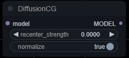

# ComfyUI Vectorscope CC | ComfyUI DIffusion CG

ComfyUI port of wonderful [SD Webui Vectorscope CC](https://github.com/Haoming02/sd-webui-vectorscope-cc) and [SD Webui Diffusion Color Grading](https://github.com/Haoming02/sd-webui-diffusion-cg) extensions by Haoming02.

Based on (and probably incompatible with) [original ComfyUI port of Diffusion CG by Haoming02](https://github.com/Haoming02/comfyui-diffusion-cg).

# Nodes

## VectorscopeCC

`VectorscopeCC` node works similar to the [original Vectorscope-CC extension](https://github.com/Haoming02/sd-webui-vectorscope-cc?tab=readme-ov-file#how-to-use), but without fancy color wheel :(

## DiffusionCG

`DiffusionCG` allows you to recenter and normalize latent noise during generation. You can read more about it's capabilities [here](https://github.com/Haoming02/sd-webui-diffusion-cg?tab=readme-ov-file#features).

Unlike the [original ComfyUI port](https://github.com/Haoming02/comfyui-diffusion-cg), mine has parity with SD WebUI version (except color adjusting features - you can use `DiffusionCG` together with `VectorscopeCC` node for that).

## NormalizeLatent
> [!WARNING]
> Deprecated, use normalization from `DiffusionCG` node instead.

`NormalizeLatent` node enhances vibrancy and contrast of an image. You can read more about normalization [here](https://github.com/Haoming02/sd-webui-diffusion-cg?tab=readme-ov-file#normalization).

Works with both SD1.5 and SDXL latents. You should put this node right before `VAEDecode`.
