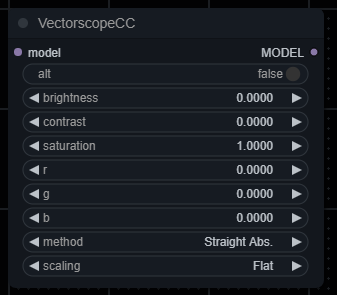
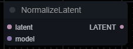

# ComfyUI Vectorscope CC

ComfyUI port of a wonderful extension [SD Webui Vectorscope CC by Haoming02](https://github.com/Haoming02/sd-webui-vectorscope-cc).

Based on (and probably incompatible with) [ComfyUI Diffusion Color Grading by Haoming02](https://github.com/Haoming02/comfyui-diffusion-cg).

# Nodes

## VectorscopeCC

`VectorscopeCC` node works similar to the [original Vectorscope-CC extension](https://github.com/Haoming02/sd-webui-vectorscope-cc?tab=readme-ov-file#how-to-use), but without fancy color wheel :(

## NormalizeLatent

`NormalizeLatent` node enhances vibrancy and contrast of an image. You can read more about normalization [here](https://github.com/Haoming02/sd-webui-diffusion-cg?tab=readme-ov-file#normalization).

Works with both SD1.5 and SDXL latents. You should put this node right before `VAEDecode`.
